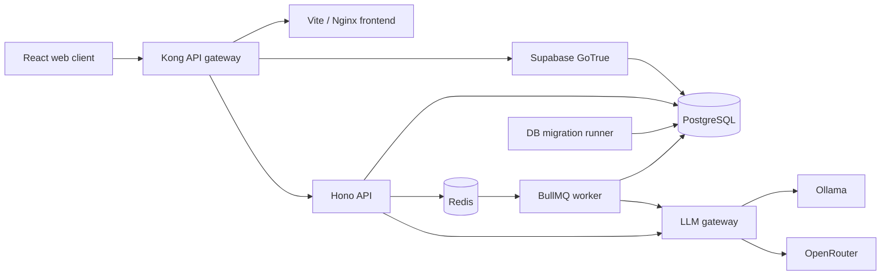

# Base Lab

> A local-first LLM control plane built as a containerized TypeScript monorepo.

Base Lab provides one authenticated interface for discovering local and remote
LLM providers, curating selectable models, downloading Ollama models, running
prompts asynchronously, and inspecting token usage and latency.

The project is intentionally small enough to understand in one sitting, while
still demonstrating service boundaries, background processing, persistent job
state, runtime validation, authentication, and provider abstraction.

## What it demonstrates

- **Service-oriented architecture:** separate API, worker, LLM gateway, web,
  authentication, database, queue, and reverse-proxy containers.
- **Asynchronous execution:** BullMQ and Redis decouple HTTP requests from LLM
  generation and long-running model downloads.
- **Hybrid model support:** live local discovery through Ollama and a curated,
  owner-scoped catalog for remote providers such as OpenRouter.
- **Dynamic provider discovery:** the web application does not hardcode provider
  names; it consumes the provider registry exposed by the LLM gateway.
- **Persistent progress:** model-pull state and normalized layer progress are
  stored in PostgreSQL and survive page reloads.
- **Usage observability:** requests, tokens, failures, and latency are tracked per
  run and aggregated by provider and model.
- **Type-safe persistence:** Kysely-backed queries with generated database types,
  plus Zod validation at service boundaries.
- **Defense in depth:** Kong key authentication, Supabase GoTrue sessions, JWT
  verification through JWKS, owner-scoped queries, and disabled public signup.

## Architecture



The frontend communicates only with the authenticated application API. The API
owns domain validation and persistence, the worker owns long-running jobs, and
the LLM gateway owns provider-specific HTTP contracts and response
normalization.

### Main flows

**Prompt execution**

```text
Web -> API -> PostgreSQL + BullMQ -> Worker -> LLM Gateway -> Provider
                                    Worker -> PostgreSQL -> Web polling
```

**Ollama model pull**

```text
Web -> API -> BullMQ -> Worker -> LLM Gateway -> Ollama NDJSON stream
                         Worker -> persisted progress -> Web polling
```

Polling is a deliberate first implementation: job state remains inspectable and
recoverable without requiring a live WebSocket connection.

## Services

| Service       | Responsibility                                                           | Technology                             |
| ------------- | ------------------------------------------------------------------------ | -------------------------------------- |
| `frontend`    | Console, run history, usage, and model settings                          | React, Vite, TanStack Query, Nginx     |
| `api`         | Authenticated BFF, validation, persistence, and queue producers          | Node.js, TypeScript, Hono, Zod, Kysely |
| `worker`      | Prompt jobs, model pulls, reconciliation, and usage tracking             | BullMQ, Redis, Kysely                  |
| `llm-gateway` | Provider registry, model discovery, generation, and stream normalization | Hono, Ollama API, OpenRouter API       |
| `auth`        | Sessions and user lifecycle                                              | Supabase GoTrue                        |
| `proxy`       | Single public entrypoint and API-key routing                             | Kong, DB-less configuration            |
| `db`          | Application, authentication, run, catalog, pull, and usage data          | PostgreSQL, `pg_cron`                  |
| `db-migrate`  | Ordered, transactional schema migrations                                 | Bash, `psql`                           |
| `redis`       | BullMQ queue storage                                                     | Redis                                  |
| `ollama`      | Local model runtime                                                      | Ollama, ROCm configuration by default  |

## Repository structure

```text
.
├── apps/
│   ├── api/                 # Authenticated application API
│   ├── db/                  # PostgreSQL container image
│   ├── llm-gateway/         # Provider abstraction and model operations
│   ├── web/                 # React application
│   └── worker/              # BullMQ consumers and reconcilers
├── infra/
│   ├── db/                  # Init scripts, migration runner, and baseline schema
│   └── kong/                # Declarative proxy configuration
├── scripts/                 # Auth bootstrap, owner creation, and license tooling
├── docker-compose.yml
└── package.json             # Repository-wide quality commands
```

## Features

### Console

- Switch between local and remote model sources.
- Select only models exposed as selectable by the API.
- Configure temperature and maximum output tokens.
- Submit asynchronous runs and follow their state through
  `pending -> running -> completed | failed`.

### Model management

- Discover provider capabilities from the LLM gateway.
- Read installed Ollama models through the application API.
- Pull local models with persisted, layer-level progress.
- Curate enabled and default remote models per authenticated owner.

### Runs and usage

- Inspect prompt, response, provider, model, parameters, status, and errors.
- Track input, output, and total tokens when reported by the provider.
- Track request counts, failures, unknown usage, and average latency.
- Aggregate usage by provider and model.

## Local setup

### Prerequisites

- Git
- Docker Engine with Docker Compose v2
- Node.js 20 or newer and npm
- Enough disk space for the selected Ollama models
- For the default Ollama service: a Linux host with AMD ROCm-compatible devices

The application is exposed through Kong at
[`http://localhost:8000`](http://localhost:8000).

### 1. Clone the repository

```bash
git clone https://github.com/nicolamaisa/api-base.git
cd api-base
cp .env.example .env
```

### 2. Configure required environment values

Open `.env` and set at least:

```dotenv
PROJECT_NAME=Base Lab
PROJECT_SLUG=base-lab

POSTGRES_USER=base
POSTGRES_PASSWORD=replace-with-a-strong-url-safe-password
POSTGRES_DB=base

SITE_URL=http://localhost:8000
AUTH_EXTERNAL_URL=http://localhost:8000/auth/v1
GOTRUE_URI_ALLOW_LIST=http://localhost:8000/**

PUBLIC_URL=http://localhost:8000

KONG_PLUGINS_CORS_CONFIG_ORIGINS='["http://localhost:5173","https://localhost:5173","http://localhost:8000"]'
KONG_PROXY_PORT=8000
```

Do not commit `.env` or any generated authentication material.

### 3. Generate local authentication keys

Generate the symmetric secret, ES256 signing key, JWKS configuration, and opaque
Supabase API keys with the bundled bootstrap script:

```bash
node scripts/add-auth-keys.mjs --update-env
```

When `JWT_SECRET` is empty or missing, the script generates it. If a valid secret
already exists, it is reused so existing sessions and symmetric signing material
are not invalidated accidentally.

The command updates `.env` and creates `.env.auth-backup`. That backup contains
secrets: keep it outside version control and remove it securely when it is no
longer needed.

### 4. Choose the Ollama runtime

The checked-in Compose configuration targets an AMD ROCm host:

```yaml
image: ollama/ollama:rocm
```

For a CPU-only machine, change the `ollama` service to:

```yaml
image: ollama/ollama:latest
```

and remove its `devices` block and the AMD-specific `HSA_*` environment value.
GPU passthrough is host-specific; adapt this service before starting the stack
when using NVIDIA, macOS, Windows, or a remote Ollama instance.

### 5. Start the stack

```bash
docker compose up -d --build
docker compose run --rm db-migrate
docker compose ps
```

`db-migrate` is a one-shot service. An `Exited (0)` status after it completes is
expected. The second command is safe to repeat because applied migration names
are tracked in `public.schema_migrations`.

Follow startup logs if a service does not become healthy:

```bash
docker compose logs -f api worker llm-gateway auth proxy
```

### 6. Create the first owner

Public signup is disabled. Create the initial account with the bundled script:

```bash
npm run auth:create-owner -- \
  --email owner@example.com \
  --name "Local Owner"
```

The password is requested interactively, is not printed, and must contain at
least 12 characters. The script also verifies the complete login flow, the ES256
access token, `/api/auth/me`, and automatic profile creation.

### 7. Sign in and add a model

1. Open [`http://localhost:8000`](http://localhost:8000).
2. Sign in with the owner account.
3. Open **Settings**.
4. Under **Local models**, pull an Ollama model and follow its persisted progress.
5. Return to **Console**, select the model, enter a prompt, and create a run.
6. Inspect the result in **Runs** and its token/latency aggregates in **Usage**.

## Optional OpenRouter setup

Add an API key to `.env`:

```dotenv
OPENROUTER_API_KEY=replace-with-your-key
OPENROUTER_BASE_URL=https://openrouter.ai/api/v1
OPENROUTER_APP_URL=http://localhost:8000
OPENROUTER_APP_TITLE=Base Lab
OPENROUTER_DEFAULT_MODEL=
```

Recreate the affected services:

```bash
docker compose up -d --build llm-gateway worker api
```

Open **Settings -> Remote models**, choose OpenRouter, and add the exact model ID
you want to expose, for example `openai/gpt-4.1-mini`. The application uses this
owner-scoped catalog instead of exposing the provider's complete model list.

## Public API surface

Kong exposes the application API below `/api`. Except for infrastructure health
checks, application routes require both the public API key and an authenticated
session.

| Method         | Path                                    | Purpose                                        |
| -------------- | --------------------------------------- | ---------------------------------------------- |
| `GET`          | `/api/llm/providers`                    | Discover configured local and remote providers |
| `GET`          | `/api/llm/providers/:providerId/models` | Return normalized selectable models            |
| `GET/POST`     | `/api/llm/model-catalog`                | List or create curated remote models           |
| `PATCH/DELETE` | `/api/llm/model-catalog/:modelId`       | Update or delete catalog entries               |
| `GET/POST`     | `/api/llm/model-pulls`                  | List or enqueue persistent local model pulls   |
| `GET`          | `/api/llm/model-pulls/:pullId`          | Inspect pull progress and terminal state       |
| `GET/POST`     | `/api/runs`                             | List or create prompt runs                     |
| `GET`          | `/api/runs/:runId`                      | Inspect a run                                  |
| `GET`          | `/api/usage/summary`                    | Account-level usage summary                    |
| `GET`          | `/api/usage/provider-models`            | Usage grouped by provider and model            |
| `GET`          | `/api/usage/runs/:runId/summary`        | Usage for one run                              |

The LLM gateway is an internal Compose service and does not publish a host port.
Browser code must call the authenticated API rather than the gateway directly.
When started separately through `npm run llm-gateway:dev`, it listens on port
`3003` by default.

## Development workflow

Docker builds install each service independently. To run repository-wide checks
on the host, install all local dependencies first:

```bash
npm ci
npm --prefix apps/api ci
npm --prefix apps/worker ci
npm --prefix apps/llm-gateway ci
npm --prefix apps/web ci
```

Run the quality gates:

```bash
npm run typecheck
npm run lint
npm run format:check
npm run license:check
```

Regenerate Kysely database types after a schema change while PostgreSQL is
running:

```bash
npm run db:types
```

Useful service-specific commands include:

```bash
npm run api:dev
npm run worker:dev
npm run llm-gateway:dev
npm run web:dev
```

When running services directly on the host, their internal Compose URLs must be
replaced with host-reachable values in the environment.

## Design decisions and boundaries

- **The API is the public application boundary.** It owns authentication,
  owner-scoped validation, persistence, and queue production.
- **The worker owns long-running work.** HTTP requests do not remain open for
  prompt execution or model downloads.
- **The LLM gateway owns provider differences.** Provider-specific URLs,
  payloads, errors, and streams do not leak into the API or frontend.
- **Remote models are curated.** A configured provider does not automatically
  make every remote model selectable.
- **Local models are discovered live.** Installed Ollama models are not copied
  into the remote catalog table.
- **Progress is persisted before real-time transport.** The UI currently polls;
  WebSocket delivery can be added later without changing the job model.

This repository is a portfolio-oriented reference implementation, not a hosted
multi-tenant platform. It currently targets a single Docker Compose deployment
and does not include TLS termination, a production secret manager, horizontal
autoscaling, billing, provider pricing, or high-availability infrastructure.

## Security notes

- Public account signup is disabled by default.
- Application queries are scoped to the authenticated owner.
- API and service-role keys must never be committed.
- The Compose file publishes Kong as the application entrypoint and PostgreSQL
  for local database tooling. Production deployments should remove the database
  port mapping and expose only the reverse proxy.
- Provider keys are server-side environment variables and are not returned to
  the browser.

## License

Copyright © 2026 Nicola Maisano. All rights reserved.

The source is public for portfolio inspection and evaluation, but it is not
open-source software. Copying, modification, distribution, or commercial use is
not permitted without explicit written permission. See [LICENSE.md](./LICENSE.md)
for the complete terms.

Third-party packages remain subject to their respective licenses. The generated
inventory is available in [raw-licenses.json](./raw-licenses.json).
